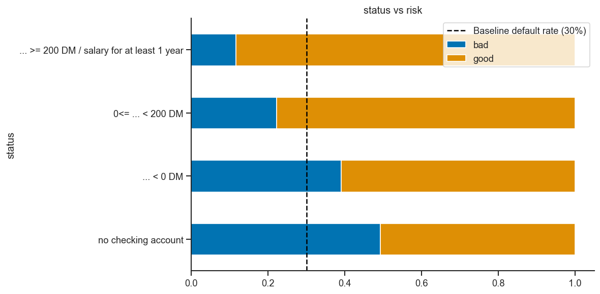
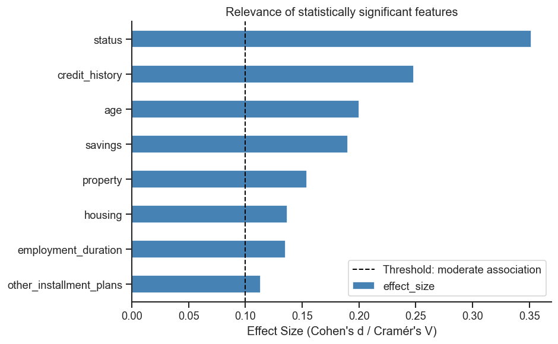

# German Credit Data – EDA Project

## Overview

This project explores the **German Credit Dataset** using exploratory data analysis (EDA) to understand 
patterns in borrower characteristics and their relationship to credit risk. 
The analysis is framed in a banking context and focuses on interpretability and business relevance.

## Objective

- Explore structure and quality of credit data  
- Identify differences between good and bad credit risk profiles  
- Analyze relationships between customer features and credit outcomes  
- Derive simple, interpretable insights relevant to credit risk analysis 

## Sample Plots from the Analysis

## Dataset
The analysis uses the corrected South German Credit dataset to avoid known 
inconsistencies in the original UCI German Credit dataset.
A custom parser is used to transform the original codebook into a structured mapping table. 
This enables reproducible renaming and categorical decoding of the dataset.

The original data can be found here:
https://archive.ics.uci.edu/dataset/522/south+german+credit

Key feature groups include:
- Loan characteristics (amount, duration, purpose)  
- Financial status (savings, checking account status)  
- Personal attributes (age, employment, housing)  
- Credit history information

The dataset consist of the following columns:

| Name                    | Description                                                              | Type        |
|-------------------------|--------------------------------------------------------------------------|-------------|
| status                  | Status of existing checking account in DM (Deutschen Mark)               | categorical |
| duration                | Duration in months for the loan/credit                                   | numerical   |
| credit_history          | Credit history of the applicant                                          | categorical |
| purpose                 | Purpose of the credit                                                    | categorical |
| amount                  | Credit amount of the loan                                                | numerical   |
| savings                 | Status of savings account in DM (Deutschen Mark)                         | categorical |
| employment_duration     | Present employment since                                                 | categorical |
| installment_rate        | Installment rate in percentage of disposable income                      | categorical |
| personal_status_sex     | Categories with personal status and sex                                  | categorical |
| other_debtors           | Other debtors / guarantors                                               | categorical |
| present_residence       | Present residence since                                                  | categorical |
| property                | Possible collateral for loan                                             | categorical |
| age                     | Age in years                                                             | numerical   |
| other_installment_plans | Other installment plans                                                  | categorical |
| housing                 | Indicator of the current housing (rent, own or for free)                 | categorical |
| number_credits          | Number of existing credits at this bank                                  | numerical   |
| job                     | Categories of job                                                        | categorical |
| people_liable           | Number of people being liable to provide maintenance for                 | categorical |
| telephone               | Flag indicating if the customer has a telephone registered in their name | categorical |
| foreign_worker          | Flag indicating foreign workers                                          | categorical |
| credit_risk             | Good = customer properly paid the loan, bad otherwise                    | categorical |
## Methodology

The analysis is structured into:

- Data overview (structure, types, missing values)  
- Univariate feature analysis
- Bivariate analysis vs. credit risk  
- Segment-based risk insights  

## Tools

- Python  
- Pandas  / numpy
- Matplotlib / Seaborn  
- scipy
- Jupyter Notebook  

## Note

This project is part of a portfolio to demonstrate structured data analysis skills in a credit risk context. It focuses on interpretability and business-relevant insights rather than predictive modeling.